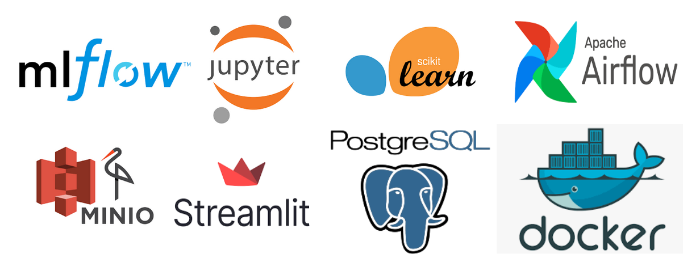
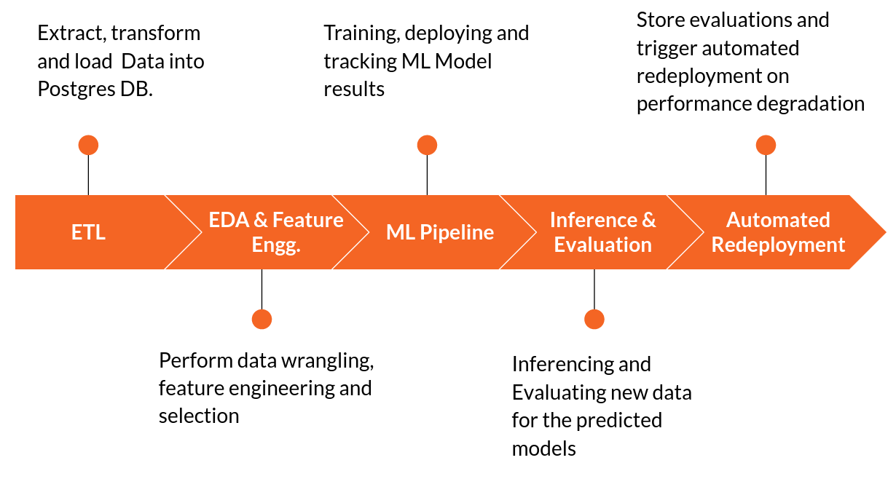
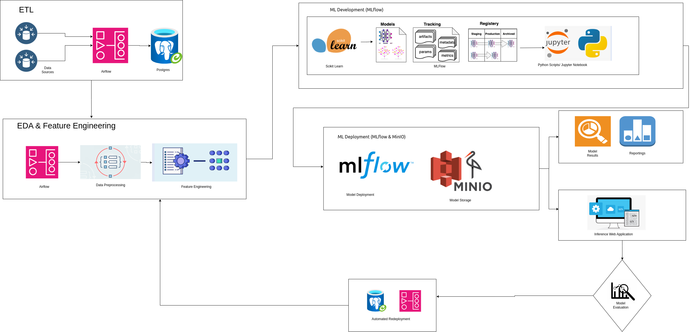
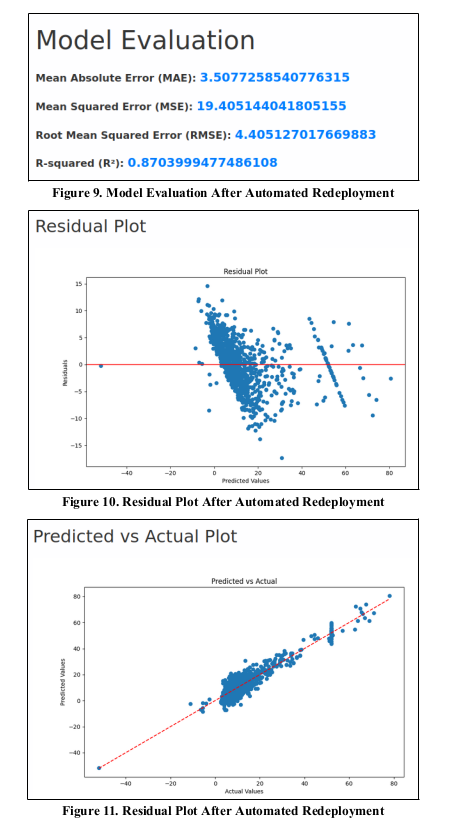

# SelfOptimizingMLPipeline

## Project Overview

This project develops a robust machine learning pipeline for fare prediction in ride-hailing services, leveraging advanced MLOps practices to handle model lifecycle management. It integrates several technologies to ensure models are not only deployable but also capable of adapting to new data trends through continuous evaluation and retraining.

## Key Features

- **ETL Process**: Automated ETL workflows using Airflow to extract, transform, and load data into PostgreSQL.
- **Machine Learning Pipeline**: Comprehensive pipeline covering data cleaning, feature engineering, model training, and validation.
- **Automated Retraining**: Incorporates performance monitoring to trigger model retraining and updating based on new data trends.
- **Experiment Tracking**: Utilizes MLflow for tracking experiments, managing models, and facilitating easy comparison of model versions.
- **Model Storage and Serving**: Models are stored and versioned in MinIO, with a Flask web application serving real-time predictions.



## Technologies Used

- **Airflow**: Orchestrates and automates the machine learning pipeline.
- **PostgreSQL**: Acts as the centralized datastore for all structured data.
- **MLflow**: Manages the machine learning lifecycle, including experiment tracking and model deployment.
- **MinIO**: Provides efficient model storage and management.
- **Flask**: Creates a user-friendly web application for model inference.
- **Streamlit**: Facilitates interactive data visualization and reporting.



## Architecture



## Output Results




## Getting Started

### Prerequisites

- Docker
- Python 3.8+
- Access to a command-line interface

### Installation

1. **Clone the Repository**
   ```bash
   git clone https://github.com/your-github-username/your-repo-name.git
   cd your-repo-name

2. **Set Up a Virtual Environment**
   ```bash
   python -m venv venv
   source venv/bin/activate  # On Windows use `venv\Scripts\activate`

3. **Airflow Dependencies**
   ```bash
   See [Airflow Setup Details](./ReadMe.md) for more information on configuring your airflow environment.


4. **MLFlow Dependencies**
   ```bash
   See [MLFlow Setup Details](./mlops/ReadMe.md) for more information on configuring your mlflow environment.

## Usage

- Access the Flask web app at `http://localhost:5001` for data uploads and predictions.
- MLflow UI is accessible at `http://localhost:5000` for experiment tracking and model management.
- Access the Airflow instance at `http://localhost:8080` for orchestration of Machine learning pipeline.
- Access the MinIO Storage instance at `http://localhost:9001` for storing trained model files for inference.
- Streamlit Reports is accessible at `http://localhost:8502`.


## Contributing

We welcome contributions! To contribute:

1. Fork the repository.
2. Create your feature branch (`git checkout -b feature/<feature_name>`).
3. Commit your changes (`git commit -m 'Add some new feature'`).
4. Push to the branch (`git push origin feature/<feature_name>`).
5. Open a pull request.

## License

This project is distributed under the MIT License. See the `LICENSE` file for more information.

## Contact

Your Name – m.mohsin.aslam@gmail.com

Project Presentation Link: https://docs.google.com/presentation/d/1u_i3r3l802wAO2RiYvlMopxcBvi3N3tvAYQuEQh4X2o/edit#slide=id.gc6fa3c898_0_0

Project Link: https://github.com/mohsin-aslam/SelfOptimizingMLPipeline.git

