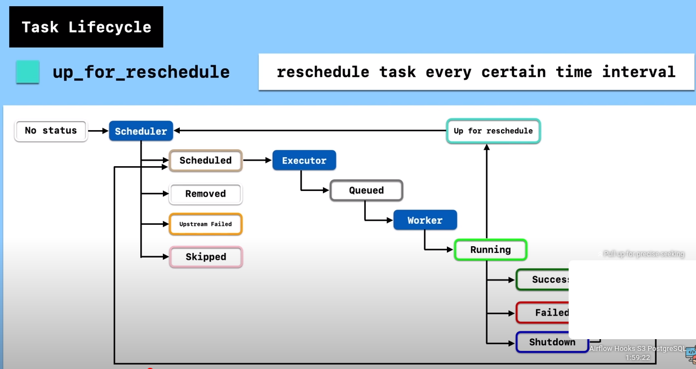
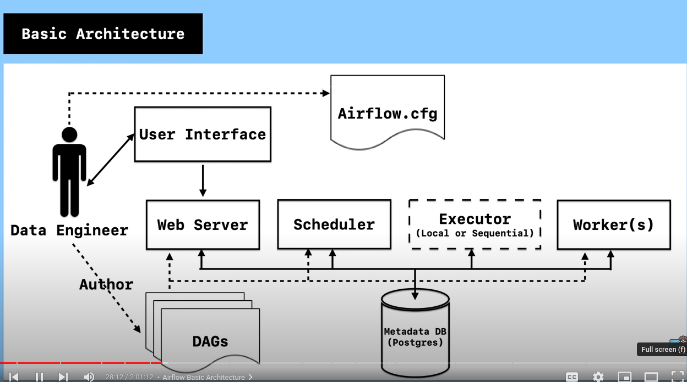

# Docker-Airflow
This repository contains Dockerfile of apache-airflow for Docker's automated build

## Informations

* Based on Python (3.8-slim-buster) and uses the official [Postgres](https://hub.docker.com/_/postgres/) as backend and [Redis](https://hub.docker.com/_/redis/) as queue
* Install [Docker](https://www.docker.com/)
* Install [Docker Compose](https://docs.docker.com/compose/install/)
* Following the Airflow release from [Python Package Index](https://pypi.python.org/pypi/apache-airflow)

## Build
docker-compose --env-file config/.env -f docker-compose-base.yml up -d --build --scale worker=3

## Install custom python package

- There is a file "requirements.txt" add desired python modules in that file
- The Docker script execute the pip install command

## UI Links

- Airflow: [localhost:8080](http://localhost:8080/)

| Variable            | Default value |
|---------------------|---------------|
| `username`          | `airflow`     |
| `password`          | `airflow`     |
| `role`              | `Admin`       |

- Flower: [localhost:5555](http://localhost:5555/)

# Simplified SQL database configuration using PostgreSQL

If the executor type is set to anything else than *SequentialExecutor* you'll need an SQL database.
Here is a list of PostgreSQL configuration variables and their default values. They're used to compute
the `AIRFLOW__CORE__SQL_ALCHEMY_CONN` and `AIRFLOW__CELERY__RESULT_BACKEND` variables when needed for you
if you don't provide them explicitly:

| Variable            | Default value |  Role                |
|---------------------|---------------|----------------------|
| `POSTGRES_HOST`     | `postgres`    | Database server host |
| `POSTGRES_PORT`     | `5432`        | Database server port |
| `POSTGRES_USER`     | `root`        | Database user        |
| `POSTGRES_PASSWORD` | `root`        | Database password    |
| `POSTGRES_DB`       | `airflow`     | Database name        |

You can also use those variables to adapt your compose file to match an existing PostgreSQL instance managed elsewhere.

Here's an important thing to consider:

> When specifying the connection as URI (in AIRFLOW_CONN_* variable) you should specify it following the standard syntax of DB connections,
> where extras are passed as parameters of the URI (note that all components of the URI should be URL-encoded).

Therefore you must provide extras parameters URL-encoded, starting with a leading `?`. For example:

    POSTGRES_EXTRAS="?sslmode=verify-full&sslrootcert=%2Fetc%2Fssl%2Fcerts%2Fca-certificates.crt"

# Simplified Celery broker configuration using Redis

If the executor type is set to *CeleryExecutor* you'll need a Celery broker. Here is a list of Redis configuration variables
and their default values. They're used to compute the `AIRFLOW__CELERY__BROKER_URL` variable for you if you don't provide
it explicitly:

| Variable          | Default value | Role                           |
|-------------------|---------------|--------------------------------|
| `REDIS_PROTO`     | `redis://`    | Protocol                       |
| `REDIS_HOST`      | `redis`       | Redis server host              |
| `REDIS_PORT`      | `6379`        | Redis server port              |
| `REDIS_PASSWORD`  | `root`        | If Redis is password protected |
| `REDIS_DBNUM`     | `1`           | Database number                |

You can also use those variables to adapt your compose file to match an existing Redis instance managed elsewhere.

# Airflow Architecture

# Airflow Task LifeCycle

